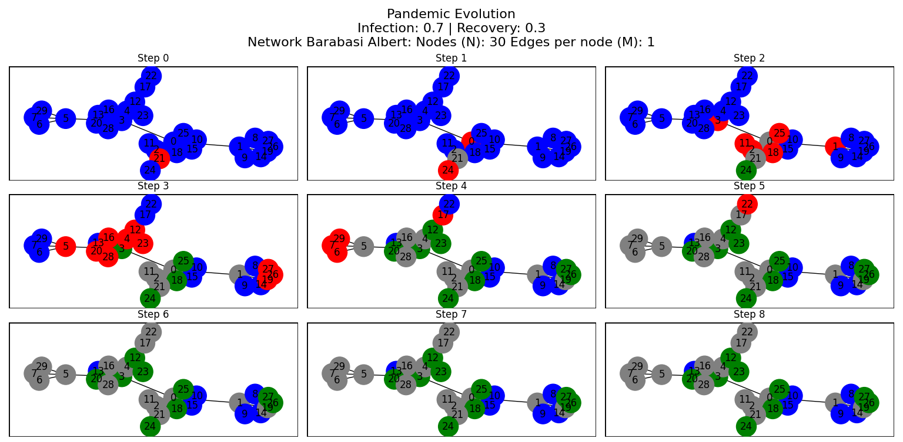
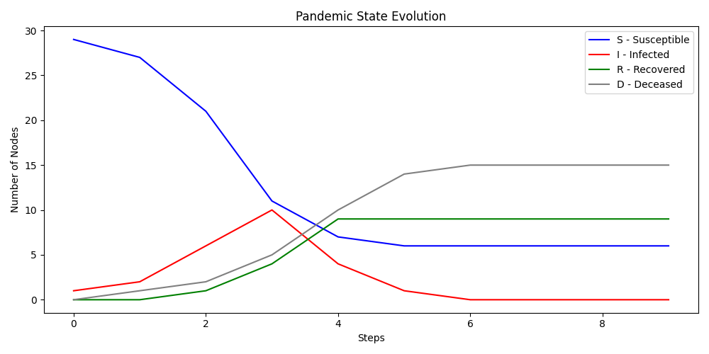

# 🦠 Pandemic Networks Simulator


**Pandemic Networks Simulator** was developed as part of the courses **Software and Computing for Applied Physics** and **Complex Networks**, within the Master’s degree program in Physics at the **University of Bologna (UniBo)**. Its main goal is to **facilitate the understanding of how the structure and properties of a network directly influence the spread of pandemics**.

Complex network theory offers a powerful conceptual and computational framework to model dynamic systems, allowing the representation of epidemiological processes through **simplified models such as SIRD** (Susceptible, Infected, Recovered, Deceased).

To achieve this, the simulator uses **classical network generation models** implemented with Python’s `networkx` library:
- **Erdős-Rényi**, which generates random graphs with uniformly distributed connections.
- **Watts-Strogatz**, which creates small-world networks with high clustering and short path lengths.
- **Barabási-Albert**, which models networks with preferential attachment, leading to the emergence of highly connected nodes (hubs).

---

## 🕸️ Implemented Networks

The simulation works with three classic models of complex networks:

### Erdős-Rényi (ER)

- **Description**: Random model where each pair of nodes is connected with a fixed probability.
- **Parameters**:
  - `N`: Number of nodes  
  - `P`: Probability of connection between each pair of nodes

> This type of network has a homogeneous structure. If `P` is too low, disconnected components may appear.

---

### Watts-Strogatz (WS)

- **Description**: Small-world model starting from a regular network and rewiring connections at random.
- **Parameters**:
  - `N`: Number of nodes  
  - `K`: Number of initial neighbors per node (must be even)  
  - `P`: Probability of rewiring the connections

> In this type of network, nodes tend to form densely connected clusters (high clustering), while distances between nodes remain short.

---

### Barabási-Albert (BA)

- **Description**: Preferential attachment model, where new nodes connect more likely to nodes with higher degree.
- **Parameters**:
  - `N`: Total number of nodes  
  - `M`: Number of edges added for each new node

> This model leads to networks where a few nodes become highly connected (hubs), and the degree distribution follows a power-law behavior.

---

## ⚙️ Infection Simulation Parameters

We define the parameters that characterize the behavior of the pandemic simulation acting on the selected network. These parameters correspond to a simplified epidemiological model of type **SIR+D** (Susceptible, Infected, Recovered, Deceased), and they determine how the infection spreads and evolves through the network.

- `Steps`: Number of simulation steps (represents time progression in the epidemic).
- `Infection probability`: Chance that an infected node transmits the infection to a susceptible neighbor.
- `Recovery probability`: Chance that an infected node recovers; otherwise, the node is marked as deceased.

---

## 📊 Graphical Outputs

1. **Network evolution**: At each step, the network (custom or default) is displayed with nodes in different states:  
   - <span style="color:blue;"><strong>Blue</strong></span>: Susceptible (S)  
   - <span style="color:red;"><strong>Red</strong></span>: Infected (I)  
   - <span style="color:green;"><strong>Green</strong></span>: Recovered (R)  
   - <span style="color:gray;"><strong>Gray</strong></span>: Deceased (D)

2. **Temporal evolution of the pandemic**: Curves showing the number of nodes in each state over time (simulation steps), reflecting the pandemic evolution under the SIR+D model.

---

## 📁 Project Structure

```
Pandemic-Networks/
├── main.py
│   └─ Main file that runs the application.
│      Contains the `SimulationApp` class, managing the overall program flow,
│      from network setup to the visualization of the pandemic.
│
├── menu.py
│   └─ Handles the text-based user interface.
│      Defines the `Menu` class, which presents interactive menus, validates user input,
│      and includes features like console clearing and error messages.
│
├── network.py
│   └─ Defines the class hierarchy for the supported networks:
│      - `ErdosRenyi`
│      - `WattsStrogatz`
│      - `BarabasiAlbert`
│      Each inherits from the base class `Network` and uses `networkx`
│      to generate network structures with specific characteristics.
│
├── pandemic.py
│   └─ Implements the pandemic model.
│      Defines the `Pandemic` class based on the SIRD model.
│      Manages node states (S, I, R, D), simulates temporal evolution,
│      and uses `matplotlib` to generate both network visualizations
│      and plots of pandemic dynamics.
│
├── README.md
│   └─ This documentation file.
│
└── tests/
    └─ Folder containing unit tests (`unittest`) to ensure the program's correct behavior.
```

---

## ▶️ Execution

```bash
# Step 1: Install the project requirements
pip install -r requirements.txt

# Step 2: Run the application
python main.py
```

Once started, a text-based menu will appear:

1️⃣ **Network Settings**  
Select the network type:
- `1` → Erdős-Rényi  
- `2` → Watts-Strogatz  
- `3` → Barabási-Albert  

You can either use default parameters or configure your own.
Each network type requires specific parameters:

- **Erdős-Rényi (ER)**:
  - `N`: Number of nodes by default (10)
  - `P`: Probability of connection between any two nodes by default (0.3)

- **Watts-Strogatz (WS)**:
  - `N`: Number of nodes by default (10)
  - `K`: Initial neighbors per node by default (4)
  - `P`: Rewiring probability by default (0.3)

- **Barabási-Albert (BA)**:
  - `N`: Total number of nodes by default (10)  
  - `M`: Number of new edges per new node by default (2)

3️⃣ **Pandemic Settings**  
Set the number of steps, infection probability, and recovery probability.  
You can also select a predefined default or setting up your own pandemic:
  - `Steps`: Number of steps by default (9)
  - `Infection`: Probability of infection by default (0.7)
  - `Recovery`: Probability of recovery by default (0.3)


5️⃣ **Generate pandemic evolution**  
Runs the simulation. Two visual outputs will be generated:
- A set of graphs showing node states over time
- A time series plot of S, I, R, D populations

---

✅ **Expected Outputs**

If the simulation runs correctly, the user will obtain the following two visual outputs (as an example — the results will vary depending on the configured parameters):

1. **Pandemic evolution on the network**  



2. **Temporal evolution of the pandemic (SIRD states)**  
  

Additionally:
- 2️⃣ → **Show Network Configuration**: displays the current network setup  
- 4️⃣ → **Show Pandemic Configuration**: displays current simulation parameters  
- 6️⃣ → **Exit**: closes the application
 
## 🧪 Automated Tests  

To run tests, use the following command:
```
python -m unittest discover -s tests -v
```

---

## 👨‍💻 Author

This simulator was developed by Mario García-Minguillán Gómez  
- 📧 mariogarcia.gomez@studio.unibo.it
- 🔗 GitHub https://github.com/Mariog3497